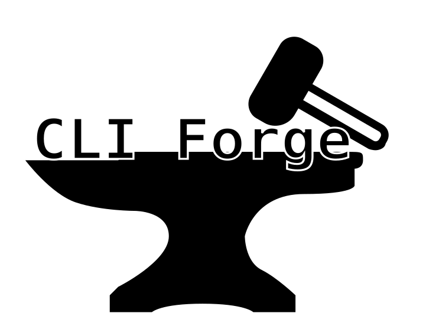

<!-- BEGIN LOGO -->



<!-- END LOGO -->

# CLI Forge

**A type-safe CLI builder for Node.js with first-class TypeScript support.**

✨ Proudly built with [Nx](https://nx.dev) ✨.

CLI Forge is a modern framework for building command-line interfaces in Node.js, designed with TypeScript developers in mind. While inspired by established tools like [yargs](https://yargs.js.org/), [commander](https://www.npmjs.com/package/commander), and [vorpal](https://vorpal.js.org/), CLI Forge prioritizes type safety and developer experience above all else.

## Why CLI Forge?

**Type Safety First** — Every option and argument you define is fully typed throughout your application. The library uses TypeScript's type inference to provide accurate intellisense and catch errors at compile time, not runtime.

**Built for Modern Node.js** — Designed from the ground up for TypeScript projects with ESM support, middleware composition, and a clean fluent API that feels natural to use.

**Comprehensive Tooling** — Generate documentation automatically from your CLI definition, test your commands with the built-in test harness, and optionally enable an interactive shell for improved user experience.

## Key Features

- **Full type inference** for parsed arguments based on your option definitions
- **Flexible option types**: strings, numbers, booleans, arrays, and nested objects
- **Command hierarchy** with unlimited nesting and inherited options
- **Middleware system** for transforming arguments before handler execution
- **Interactive shell** (opt-in) for easier exploration of complex command trees
- **Automatic documentation generation** to markdown or JSON formats
- **Configuration file support** with inheritance via `extends`
- **Built-in test harness** for unit testing your CLI commands
- **Comprehensive validation** with custom validators, choices, and cross-option constraints

## Quick Start

To create a new CLI, simply run:

```bash
npx cli-forge init my-cli
```

## Manual Installation

To install the full command library, run:

```bash
npm install cli-forge
```

Then, create a new file (e.g. `my-cli.ts`), and add the following code:

```js
import { cli } from 'cli-forge';

cli('my-cli')
  .command('hello', {
    description: 'Say hello to the world',
    builder: (args) =>
      args.option('name', {
        type: 'string',
        description: 'The name to say hello to',
      }),
    handler: (args) => {
      console.log(`Hello, ${args.name}!`);
    },
  })
  .forge();
```

## Usage

See docs for more examples: [https://craigory.dev/cli-forge/examples](https://craigory.dev/cli-forge/examples)

### Basic Example

To create a new CLI, save the below code to a file (e.g. `my-cli.js`), and run it with Node.js:

```js
import { cli } from 'cli-forge';

cli('my-cli')
  .command('hello', {
    description: 'Say hello to the world',
    builder: (args) =>
      args.option('name', {
        type: 'string',
        description: 'The name to say hello to',
      }),
    handler: (args) => {
      console.log(`Hello, ${args.name}!`);
    },
  })
  .forge();
```

Then run the CLI with:

```bash
node my-cli.js hello --name "World"
```

Then, to generate documentation for the CLI, run:

```bash
npx cli-forge generate-docs my-cli.js
```

This should generate a folder called `docs` containing markdown documentation for the CLI. Alternatively, you can pass `--format json` to generate JSON documentation to further process.

## Subshells

`cli-forge` ships with a simplistic subshell to make interactively running commands feel a bit nicer. The subshell is entirely opt-in, and can be enabled by calling `.enableInteractiveShell()` on your top level command.

If enabled, running any command that has subcommands without specifying a subcommand will drop you into the subshell. This allows you to run subcommands without having to retype the top level command.

See the [subshell example](https://craigory.dev/cli-forge/examples/interactive-subshell) for more information and a concrete example.

More improvements to the subshell are planned in the future.

## Generating Documentation

`cli-forge` can generate documentation for your CLI based on the commands and options that you've defined. To generate documentation, run:

```bash
npx cli-forge generate-docs my-cli.{js,ts}
```

By default, this will generate markdown documentation in a folder called `docs`. You can also pass `--format json` to generate a JSON object representation of your CLI instead. This is useful as a middle step if you want to generate documentation in a different format, or just a different style of markdown.

## How It Compares

### vs. Yargs

CLI Forge shares a similar fluent API style with yargs, but makes different tradeoffs:

**What CLI Forge adds:**
- Superior TypeScript inference that tracks every option through the chain
- Built-in middleware system for argument transformation
- Interactive shell support (inspired by vorpal)
- Integrated documentation generation (`cli-forge generate-docs`)
- Test harness for unit testing CLI commands
- Configuration file inheritance with `extends`

**Intentional differences:**
- **No usage string parsing** — To maintain type safety, options must be explicitly declared rather than parsed from usage strings
- **No unknown option parsing** — Unknown options aren't captured by design; explicit option definitions ensure type safety
- **No filesystem-based routing** — Commands are registered programmatically for better discoverability and refactoring support

### vs. Commander

Commander offers a lightweight API, while CLI Forge provides more structure:

**CLI Forge advantages:**
- Full TypeScript type inference throughout the argument chain
- Richer option types (nested objects with typed properties)
- Middleware composition
- Built-in configuration file support with inheritance
- Automatic documentation generation
- Interactive shell mode

### vs. Vorpal

Vorpal pioneered interactive CLI shells but hasn't been maintained since 2018. CLI Forge brings that concept forward:

**Modern improvements:**
- Active maintenance with TypeScript-first design
- Opt-in interactive shell (not required)
- Contemporary Node.js and TypeScript support
- Comprehensive testing utilities
- Documentation generation tooling

### Design Philosophy

CLI Forge prioritizes **user type safety** over internal implementation purity. While the library uses type assertions internally where necessary due to TypeScript limitations, the public API provides full type inference and safety. The goal is a CLI framework that feels natural in TypeScript projects while catching as many errors as possible at compile time.

## Contributing

Contributions are welcome! Please see the [contributing guide](CONTRIBUTING.md) for more information.
